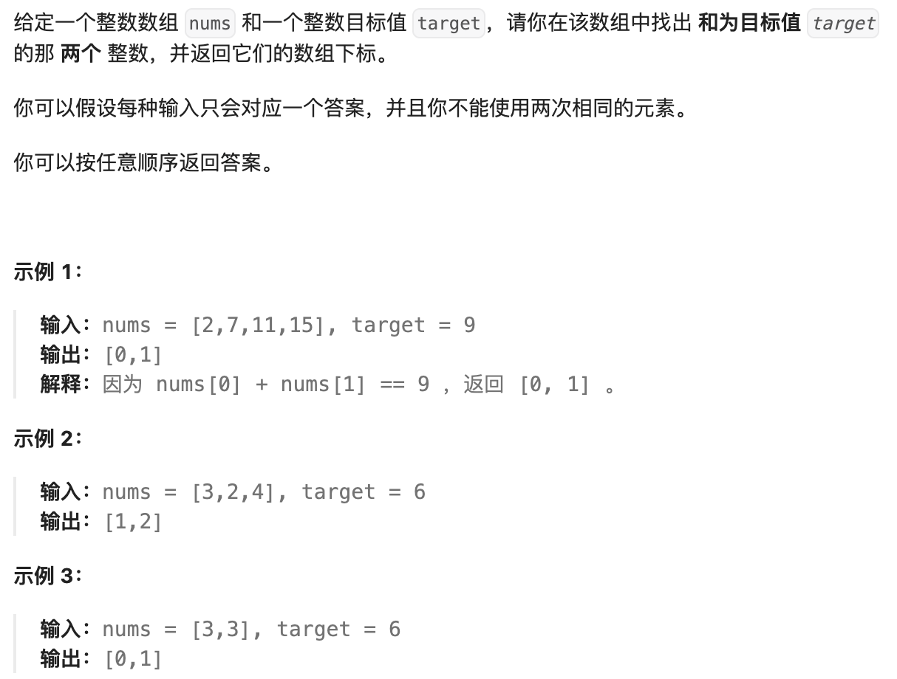
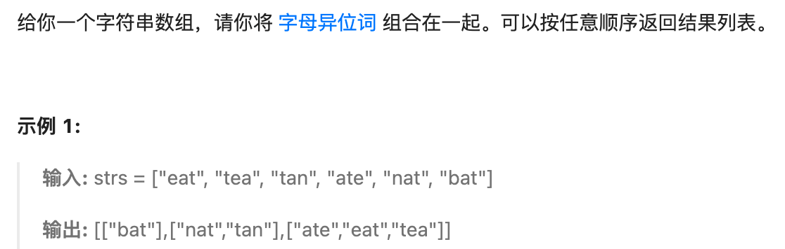
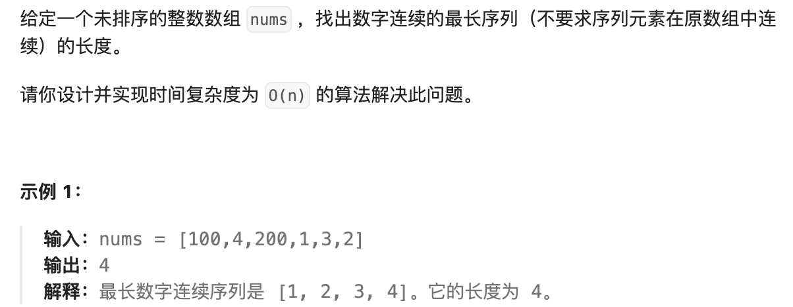
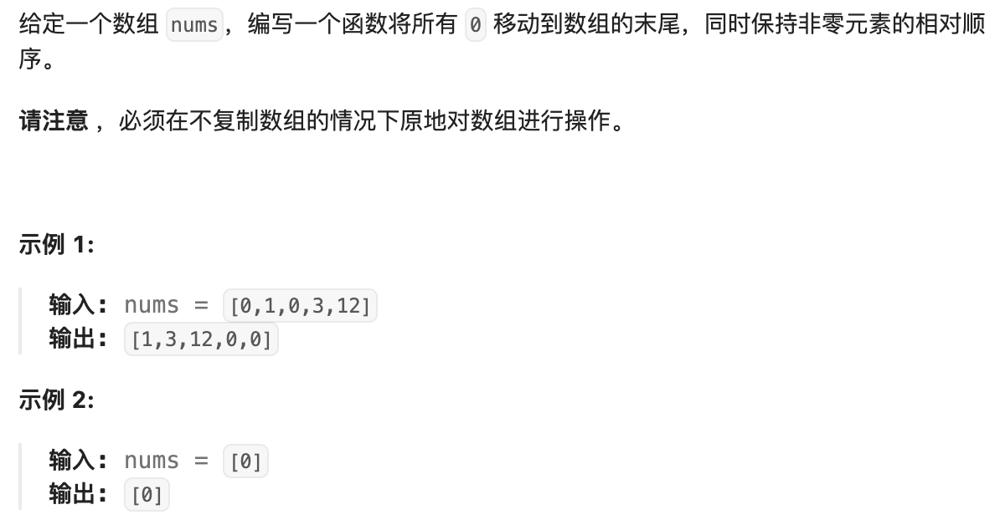
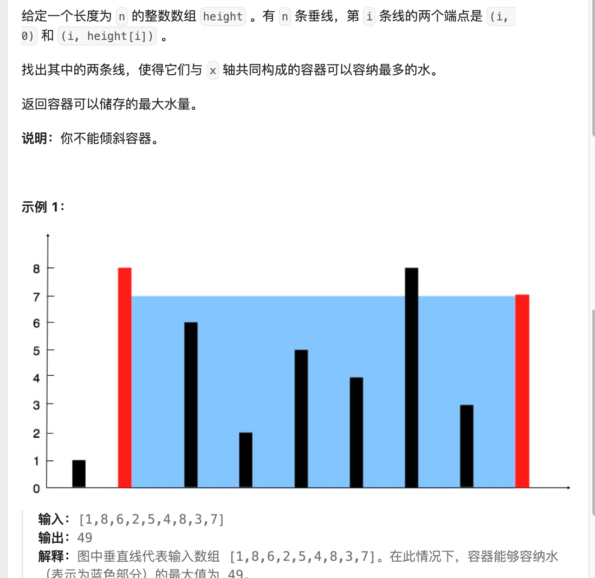
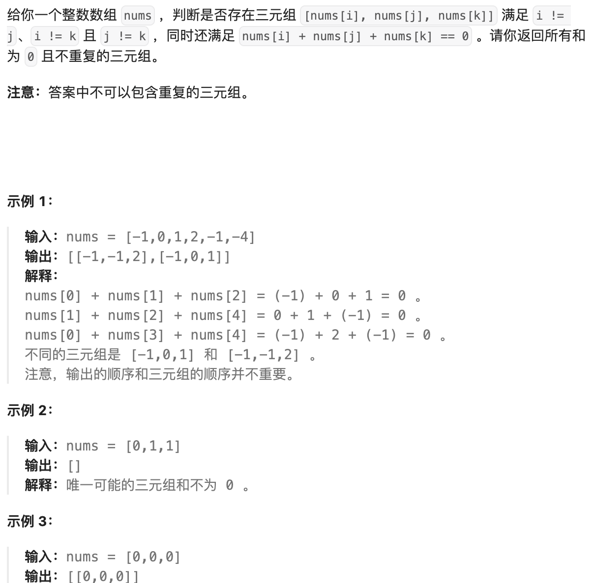

### 哈希

#### 1.两数之和



1. java中的length属性是针对数组说的,比如说你声明了一个数组,想知道这个数组的长度则用到了length这个属性.

2.  java中的length()方法是针对字符串String说的,如果想看这个字符串的长度则用到length()这个方法.

3. java中的size()方法是针对泛型集合说的,如果想看这个泛型有多少个元素,就调用此方法来查看!

   https://www.runoob.com/java/java-hashmap.html

```java
class Solution {
    public int[] twoSum(int[] nums, int target) {

        HashMap <Integer, Integer> position = new HashMap<>();
        for (int i=0; i<nums.length;i++){
            if (position.containsKey(target - nums[i])){
                return new int[]{position.get(target-nums[i]), i};
            }
            position.put(nums[i], i);
        }
        return new int[0];
    }
}
```

#### 2. 字母异位词分组



```java
class Solution {
    public List<List<String>> groupAnagrams(String[] strs) {

        Map<String, ArrayList<String>> map = new HashMap<>();
        for (int i=0; i< strs.length;i++){
            char[] tempstr = strs[i].toCharArray();
            Arrays.sort(tempstr);

            String key = new String(tempstr);
            ArrayList<String> list = map.getOrDefault(key, new ArrayList<String>());
            list.add(strs[i]);
            map.put(key, list);  
        }

        return new ArrayList<List<String>>(map.values());     
    }
}
```

####  3. 最长连续序列



 ```java 
 class Solution {
     public int longestConsecutive(int[] nums) {
 /// 会超时， 找到一个没有前缀的，而不是，每一个数都往后面找！！！
 /// 如果每一个数都往后找，则先排序，再从前往后找，中间断开时，直接跳过！！！
         HashSet<Integer> set = new HashSet<>();
 
         for(int num: nums){
             set.add(num);
         }
         int answer = 0;
         for(int num: nums){
             int temp = num-1;
             int tempanswer = 1;
             while(set.contains(temp)){
                 tempanswer += 1;
                 temp -= 1;
             }
 
             answer = Math.max(answer, tempanswer);
         }
     return answer;
         
     }
 }
 
 
 class Solution {
     public int longestConsecutive(int[] nums) {
         Set<Integer> num_set = new HashSet<Integer>();
         for (int num : nums) {
             num_set.add(num);
         }
 
         int longestStreak = 0;
 
         for (int num : num_set) {
             if (!num_set.contains(num - 1)) {
                 int currentNum = num;
                 int currentStreak = 1;
 
                 while (num_set.contains(currentNum + 1)) {
                     currentNum += 1;
                     currentStreak += 1;
                 }
 
                 longestStreak = Math.max(longestStreak, currentStreak);
             }
         }
 
         return longestStreak;
     }
 }
 
 作者：力扣官方题解
 链接：https://leetcode.cn/problems/longest-consecutive-sequence/solutions/276931/zui-chang-lian-xu-xu-lie-by-leetcode-solution/
 来源：力扣（LeetCode）
 著作权归作者所有。商业转载请联系作者获得授权，非商业转载请注明出处。
 ```

### 双指针

##### 1. 移动零



```java
class Solution {
    public void moveZeroes(int[] nums) {
        // 快慢双指针！！！
        int right=0;
        int left =0;
        while(right<nums.length){
            if(nums[right]!=0){
                
                nums[left] = nums[right];
                left ++;
            }
            right ++;
        }
        while(left < nums.length){
            nums[left] = 0;
            left ++;
        } 
    }
}
```

##### 2. [盛最多水的容器](https://leetcode.cn/problems/container-with-most-water/)



```java
class Solution {
    public int maxArea(int[] height) {

        // 双指针！！！
        int i=0;
        int j = height.length-1;
        int answer = 0;
         while(i< j){

            answer = Math.max(answer, (j-i)*(Math.min(height[i],height[j])));
            //System.out.println((j-i)*(Math.min(height[i],height[j])));
            if(height[i] < height[j]){
                i++;
            }else{
                j--;
            }
         }
         return answer;
        
    }
}
```

#### 3. [15. 三数之和](https://leetcode.cn/problems/3sum/)



```java
class Solution {
    public List<List<Integer>> threeSum(int[] nums) {
      
      // 排序 + 双指针！！！
        Set<List<Integer>> res = new HashSet<>();
        Arrays.sort(nums);
        for(int i = 0; i < nums.length; i++){
            int left = i + 1, right = nums.length - 1;
            while(left < right){
                if(nums[i] + nums[left] + nums[right] == 0){
                    res.add(new ArrayList<>(Arrays.asList(nums[i],nums[left],nums[right])));
                    left++;
                    right--;
                }else if(nums[i] + nums[left] + nums[right] < 0){
                    left++;
                }else{
                    right--;
                }
            }
        }
        List<List<Integer>> ress = new ArrayList<>(res);
        return ress;
    }
}
```

